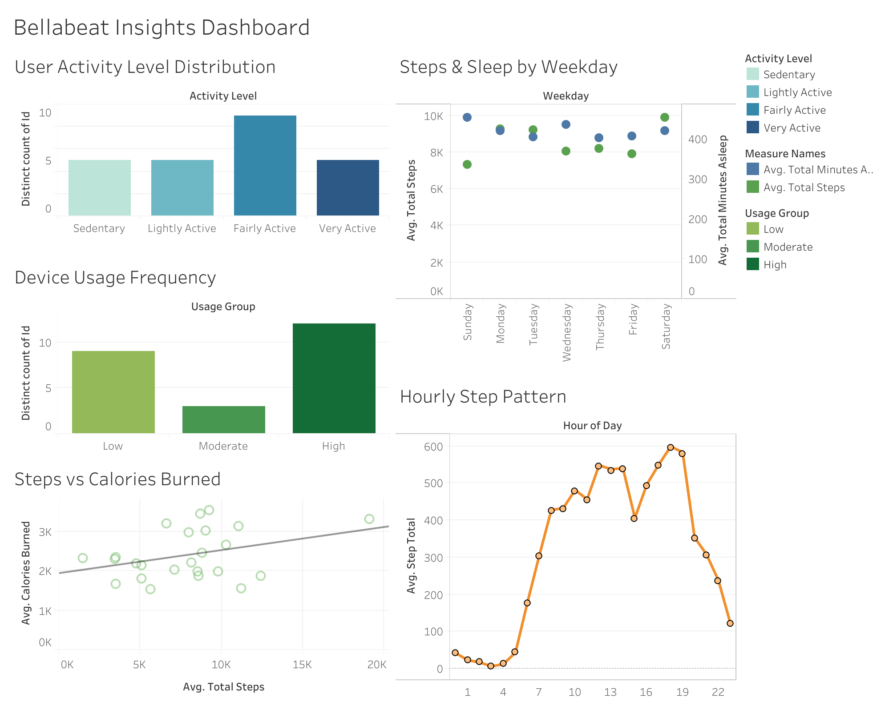

# Bellabeat Case Study

Welcome to my Bellabeat Data Analysis Case Study! This project demonstrates my ability to perform structured data preparation, analysis, visualization and deliver actionable insights aligned with real-world business objectives.

Bellabeat is a high-tech wellness company creating innovative health-focused products tailored specifically for women. In this case study, I leverage publicly available fitness data to explore consumer usage trends and apply these insights to Bellabeat's marketing strategy.

---

## Background
Bellabeat is founded by Urška Sršen and Sando Mur, the company seeks to leverage smart device data to improve its marketing strategies and product offerings. Their products include wellness trackers such as Leaf, wellness watches like Time, and hydration-tracking water bottles like Spring.

## Objectives
- **Objective 1**: Identify trends in smart device usage.
- **Objective 2**: Understand how these trends relate to Bellabeat’s current customer base.
- **Objective 3**: Develop actionable recommendations to enhance Bellabeat's marketing strategy.

## Problem
Bellabeat wants to understand how consumers utilize non-Bellabeat smart wellness devices to identify market trends, enhance their product strategy, and improve customer engagement. The company seeks insights into user behaviors and preferences that can inform targeted marketing campaigns and boost product adoption.

---

## Project Structure
Navigate through the detailed case study:

- **[Step 1: Ask](step1_ask/)** – Define business goals clearly.
- **[Step 2: Prepare](step2_prepare/)** – Data sourcing, evaluation, and initial exploration.
- **[Step 3: Process](step3_process/)** – Data cleaning and transformation.
- **[Step 4: Analyze](step4_analyze/)** – Statistical analysis and insights.
- **[Step 5: Share](step5_share/)** – Visualizations and communicating findings.
- **[Step 6: Act](step6_act/)** – Actionable recommendations and strategic decisions.

---

## Tools and Technologies Used
- **R** (Data cleaning, exploratory analysis)
- **SQL** (Data querying and transformation)
- **Tableau/ggplot2** (Visualization and storytelling)
- **Excel/Google Sheets** (Quick data inspections)

---

## Featured Dashboard on Tableau

Here is a featured snapshot of my Tableau dashboard, showcasing key behavior patterns and trends uncovered through analysis:

<em>↳ Click the image above to open the full interactive version on Tableau Public</em>

<!--   
↳ *Click the image above to open the full interactive version on Tableau Public* -->

---

## Data Source
- Publicly available [FitBit Fitness Tracker Data](https://www.kaggle.com/datasets/arashnic/fitbit) from Kaggle, licensed under CC0 Public Domain.

---

<!-- 🔗 🔜 **[Next: Step 1: Ask →](step1_ask/)** -->

<!-- 

  🔜 <a href="step1_ask/">Next: Step 1: Ask →</a>

 -->

<!-- 

  🔜 <a href="{{ '/step1_ask/' | relative_url }}">Next: Step 1: Ask →</a>

 -->

  🔜 <a href="step1_ask/">Next: Step 1: Ask →</a>

## Author
[Yi-Hsuan Chiang](https://github.com/YiChiang12)

---

## License
© [2025] [Yi-Hsuan Chiang]  
Licensed under [CC BY-NC 4.0](https://creativecommons.org/licenses/by-nc/4.0/)