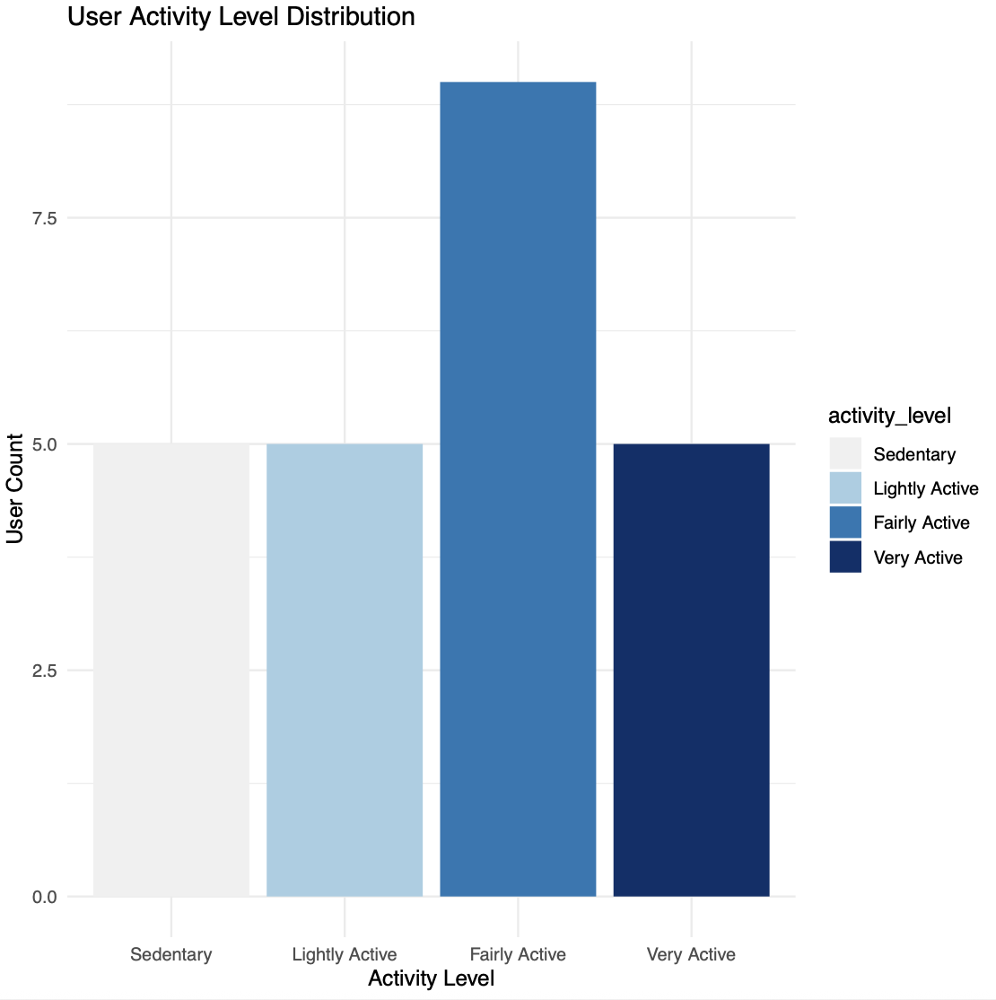
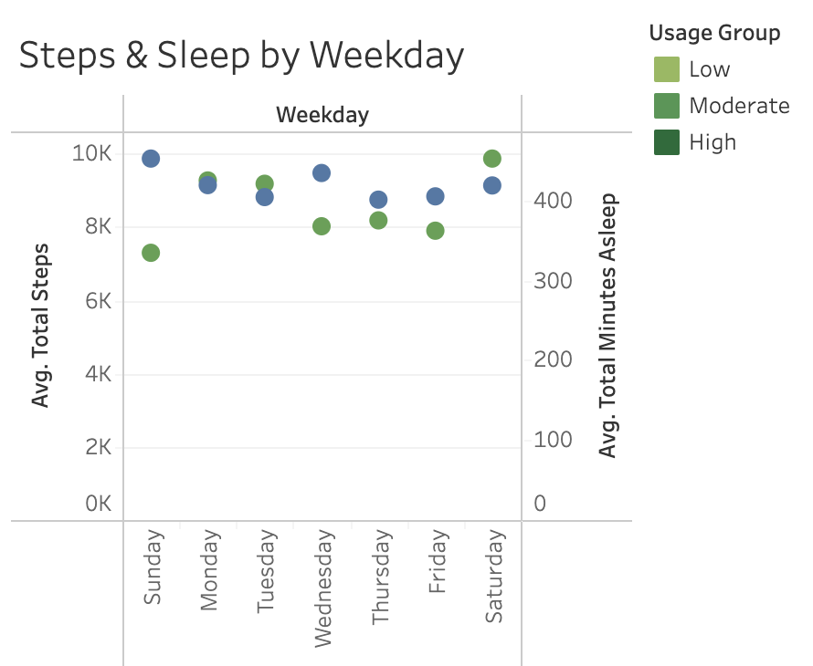
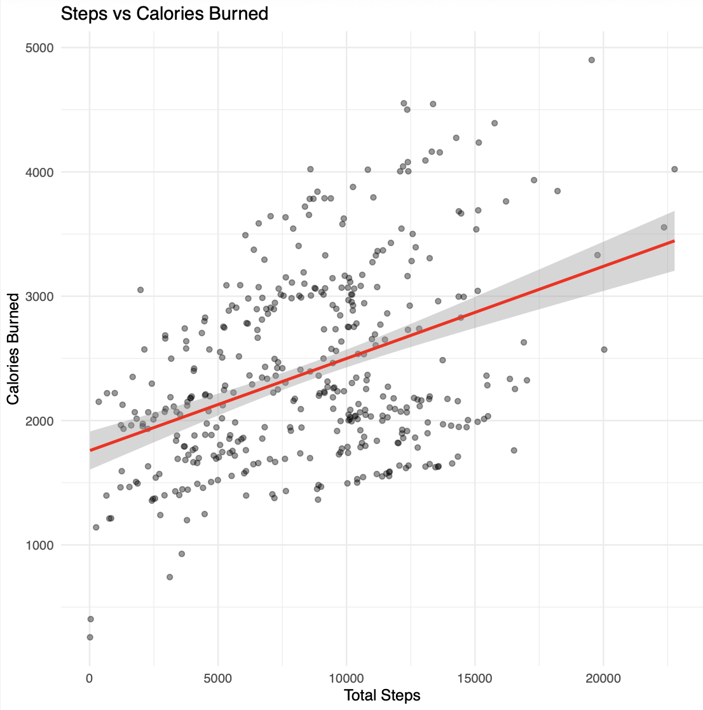
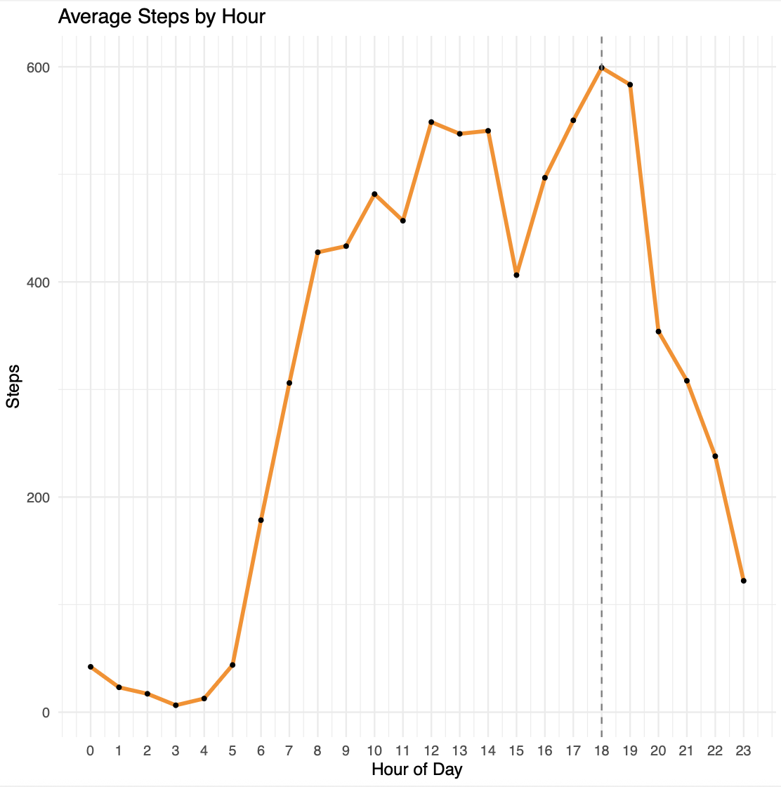
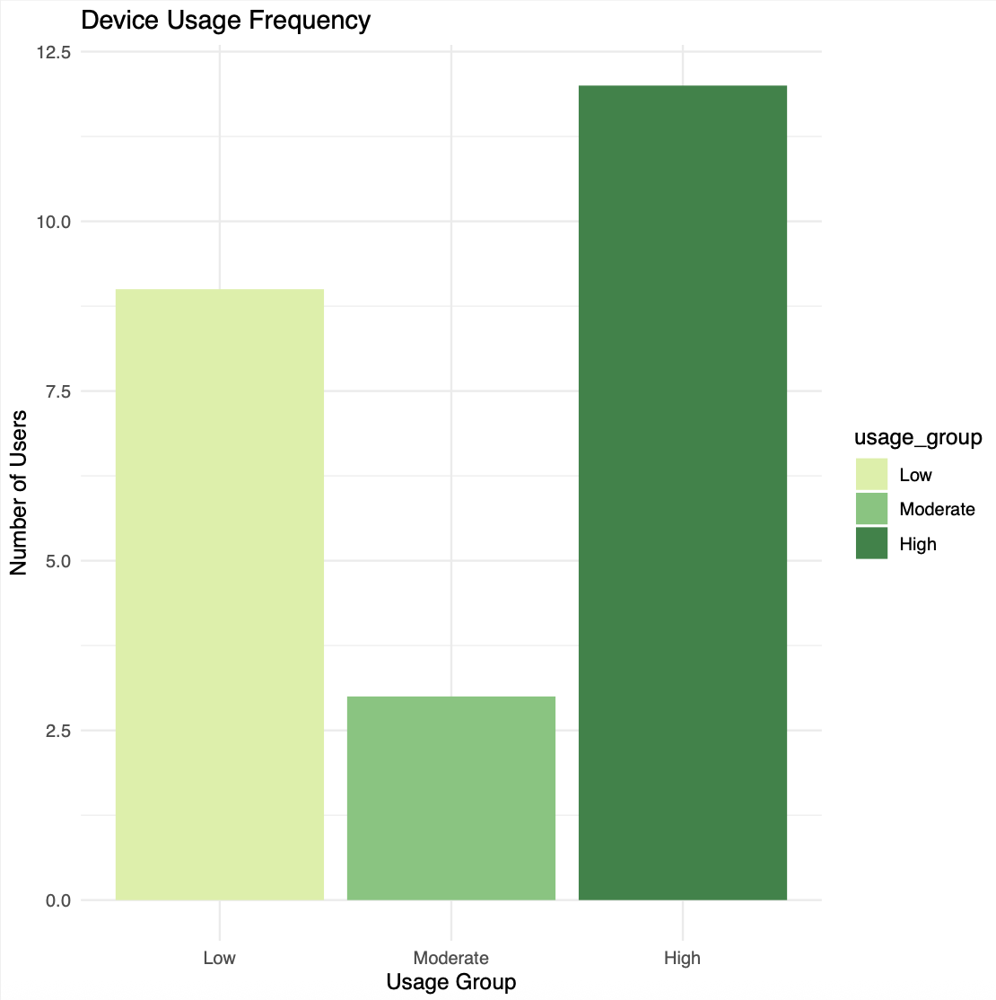

# Step 5: Share Insights

In this final step, we summarize findings from the analysis to communicate actionable recommendations to Bellabeat’s stakeholders.

---

## Key Insights

### 1. User Activity Levels

- The **Fairly Active** group has the **highest number of users**, surpassing Sedentary, Lightly Active, and Very Active categories.
- This suggests users are engaging in moderate-intensity activity but may not consistently reach Very Active thresholds.
- *Recommendation*: Bellabeat can tailor programs to support and reward Fairly Active users to sustain and boost their activity. For Sedentary/Lightly Active groups, introduce gentle challenges and encouragement features to increase engagement.

### 2. Weekday Behavior Patterns

- **Steps** and **sleep duration** show consistent patterns:
  - Step counts are slightly higher mid-week (Wed–Fri).
  - Sleep duration tends to dip during weekends.
- *Recommendation*: Use push notifications or badges to encourage step activity on low-activity days (e.g., Sunday) and promote sleep hygiene on weekends.

### 3. Steps vs. Calories & Sleep

- There is a **strong positive correlation** between steps and calories burned.
- No strong linear relationship between steps and sleep, though loess smoothing shows minor trends.
- *Recommendation*: Emphasize activity for calorie goals, but offer separate modules/tips for sleep improvements.

### 4. Hourly Step Trends

- Peak steps occur around **12–1 PM** and again in **early evening** (~6 PM).
- *Recommendation*: Target these windows for in-app encouragement like stretch reminders or “move now” prompts.

### 5. Device Usage Frequency

- Users can be grouped as:
  - **High use**: 21+ days (consistent)
  - **Moderate**: 11–20 days
  - **Low**: 1–10 days
- *Recommendation*: 
  - For low/moderate users, deploy retention strategies (e.g., streak rewards).
  - For high users, promote deeper insights or premium features.

---

## Deliverables

- Visual summaries of key trends **(Generated using R)**: `Rplots_new.pdf`
- Analysis code: `scripts/analysis.R`
<!-- - Analysis code: [`analyze.R`](../../scripts/analysis.R) -->
- Processed datasets located in: `data/processed_data/`

---

## Next Steps

<!-- 1. Present these insights to marketing and product teams. -->
1. Build user personas based on behavior clusters.
2. Iterate on app feature design and A/B test engagement nudges.
3. Track post-launch behavior against baseline trends.

---

<!-- 🔗 **[← Back to Step 4: Analyze](../step4_analyze/)** | 🔜 **[Next: Step 6: Act →](../step6_act/)** -->

  🔗 <a href="../step4_analyze/">← Back to Step 4: Analyze</a>
  🔜 <a href="../step6_act/">Next: Step 6: Act →</a>

---

© [2025] [Yi-Hsuan Chiang]  
Licensed under [CC BY-NC 4.0](https://creativecommons.org/licenses/by-nc/4.0/)